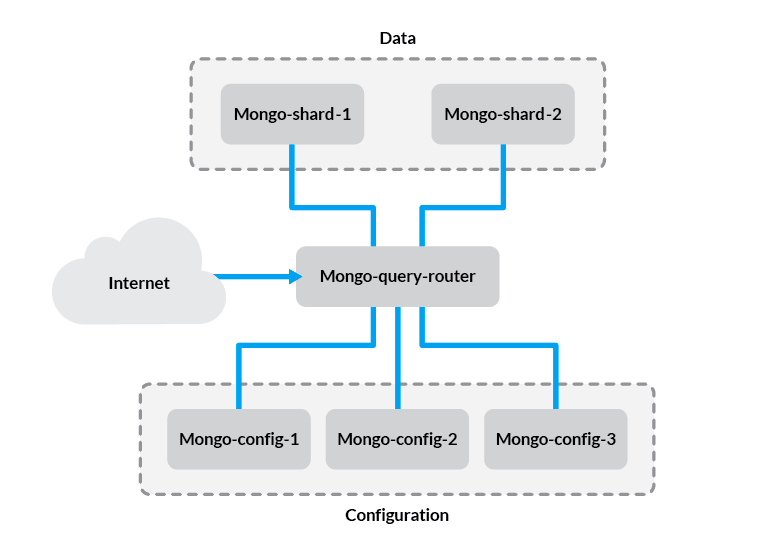
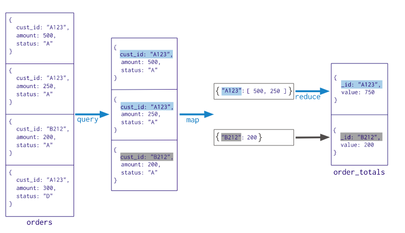

# mongoDB-assignment

## Sharding
##### What is sharding in mongoDB?
Sharding in general is a methodology that splits up large databases into smaller, faster more manageable data shards. Applying sharding to your mongoDB server is the go to strategy when your database is getting too large for your servers to handle efficiently. Distributed data shards is reffered to as a sharded cluster.

[mongoDB official docs - sharding](https://docs.mongodb.com/manual/sharding/)
> Vertical Scaling involves increasing the capacity of a single server, such as using a more powerful CPU, adding more RAM,or increasing the amount of storage space. Limitations in available technology may restrict a **single machine from being sufficiently powerful for a given workload.**
##### What are the different components required to implement sharding?
A cluster primarely has 3 components, routers, config servers and shards. I will elaborate a bit on them individually.
* Routers are the mongos daemon which is the interface to your data. It takes information parsed from the driver and executes queries on your sharded clusters. A distributed cluster could have multiple routers, a popular usecase would be having a router for each application server, however in some cases you want to have more dedicated routers, an example could be to have routers operating on the shards. The mongo routers executes their queries by:  
[mongoDB official docs - query routers](https://docs.mongodb.com/manual/core/sharded-cluster-query-router/)
> 1. Determining the list of shards that must receive the query.
> 2. Establishing a cursor on all targeted shards.
> 
> The mongos then merges the data from each of the targeted shards and returns the result document. Certain query modifiers, > such as sorting, are performed on a shard such as the primary shard before mongos retrieves the results.
* Config servers define metadata for a sharded cluster. The metadata specifies critical information about a sharded cluster, like configurationdata and what data it stored where etc. The query routers caches this metadata and use it to determine what sharded clusters to query upon. 
* Shards is a database server that stores a portion of the clusters data. Quering on a single shard would only result in a subset of the data. So let's say you have a datanase as a sharded cluster spanning three servers, it would look something like:  
* shard - Server 4 (Primary)
* shard - Server 5 (Secondary)
* shard - Server 6 (Secondary)  
Every database has a primary shard that holds all the un-sharded collections for a database. As long as sharding individual collections has not been implemented, then the collections **must** have a primary shard.

##### Explain architecture of sharding in mongoDB?
Having explained the 3 main components used to operate a sharded cluster, they are connected as follows:
 
Demonstrated in the example, we can see how each component communicates. The internet/application server asks for data through the routers, communicating with the shards having the necersarry information about the shards from the config servers.

## MapReduce
MapReduce is a methodology that has gained a lot of traction recently. Using JavaScript a straight forward explanation would be to utilize the ``map()`` and ``reduce()`` function on a dataset. First you map your data, to provide a minimal dataset needed by your reduce. The reduce (as the name implies) reduces the data to the wanted result.
 

##### Import the twitter data provided and utilize the mapreduce function to query the 10 most used languages in posts.
```js
 db.tweets.mapReduce(
    function() {
        emit(this.lang, 1);
    },
    function(id, language) {
        return Array.sum(language)
     },
    { out: "most used languages" }
).find().sort({value: -1}).limit(10)
```
Result: 
```json
/* 1 */
{
    "_id" : "en",
    "value" : 702.0
}

/* 2 */
{
    "_id" : "tr",
    "value" : 166.0
}

/* 3 */
{
    "_id" : "es",
    "value" : 21.0
}

/* 4 */
{
    "_id" : "fr",
    "value" : 19.0
}

/* 5 */
{
    "_id" : "und",
    "value" : 10.0
}

/* 6 */
{
    "_id" : "in",
    "value" : 9.0
}

/* 7 */
{
    "_id" : "pt",
    "value" : 7.0
}

/* 8 */
{
    "_id" : "ht",
    "value" : 6.0
}

/* 9 */
{
    "_id" : "ro",
    "value" : 4.0
}

/* 10 */
{
    "_id" : "de",
    "value" : 3.0
}
```
##### Also by using mapreduce, query the 10 most used hashtags, based on posts text content.

To be honest, this is obviously not an optimal implementation. The regular expression matches the spaces leading up to a hashtag and I have difficulties troubleshooting why the ``\n`` is matched.

```js
db.tweets.mapReduce(
    function() {
        var foundMatches = /(^|\s)(#[a-z\d-]+)/.exec(this.text)
        if(foundMatches !== null){
            foundMatches.forEach(hashtag => {
                if(hashtag.charAt(0) !== ' ' && hashtag !== "\n"){
                    emit(hashtag, 1)   
                }
            })
        }
    },
    function(id, count) {
        return Array.sum(count)
     },
     
    { out: "most used regular expressions" }
).find().limit(10).sort({value: -1})
``` 
Result: 
```json
/* 1 */
{
    "_id" : "#webinar",
    "value" : 12.0
}

/* 2 */
{
    "_id" : "#javascript",
    "value" : 10.0
}

/* 3 */
{
    "_id" : "#job",
    "value" : 10.0
}

/* 4 */
{
    "_id" : "#php",
    "value" : 8.0
}

/* 5 */
{
    "_id" : "#sales",
    "value" : 8.0
}

/* 6 */
{
    "_id" : "#nodejs",
    "value" : 7.0
}

/* 7 */
{
    "_id" : "#devfestizmir",
    "value" : 4.0
}

/* 8 */
{
    "_id" : "#globalmoms",
    "value" : 4.0
}

/* 9 */
{
    "_id" : "#jobs",
    "value" : 4.0
}

/* 10 */
{
    "_id" : "#angularjs",
    "value" : 3.0
}
``` 
# MongoDB-assignment
